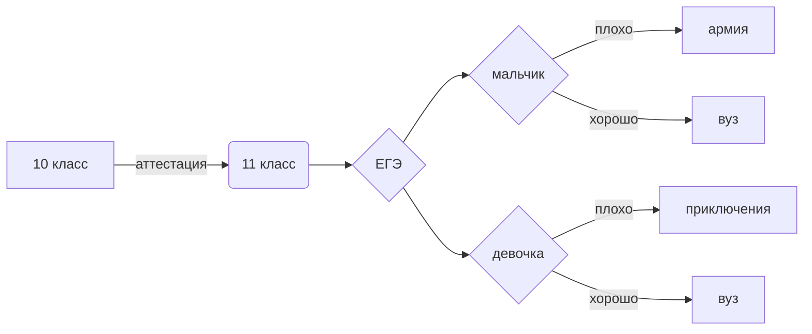
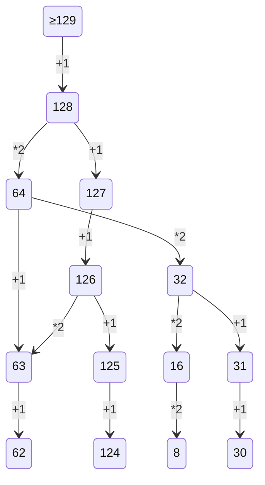

# tpu-learn
## Никитин Павел 122А

### Аккаунты
[Wordpress](https://pxnandi.wordpress.com) 
[Open Processing](https://openprocessing.org/user/344180) 
[Codepen](https://codepen.io/pxnandi/pen/vYjoabO)

### Задания ЕГЭ
[ege](https://github.com/pxnandi/tpu-learn/tree/main/ege)

### База данных
[DB.py](https://github.com/pxnandi/tpu-learn/blob/main/DB.py)

### Код Хэмминга
[Hamming.ipynb](https://github.com/pxnandi/tpu-learn/blob/main/Hamming.ipynb)

### Задание с логикой 
[Logic.xlsx](https://github.com/pxnandi/tpu-learn/blob/main/Logic.xlsx)

### Перевод в десятичную систему на Python
[Task1.py](https://github.com/pxnandi/tpu-learn/blob/main/Task1.py)

### Перевод из десятичной системы на Python
[Task2.py](https://github.com/pxnandi/tpu-learn/blob/main/Task2.py)

### Таблица умножения на разных системамх счисления на Python
[Task3.py](https://github.com/pxnandi/tpu-learn/blob/main/Task3.py)

### Кол-во информации и вес на Python (работает только с цифрами)
[first.py](https://github.com/pxnandi/tpu-learn/blob/main/first.py)

### Азбука Морзе
[morze.xlsx](https://github.com/pxnandi/tpu-learn/blob/main/morze.xlsx)

### Объединение знаний по Python
[python.ipynb](https://github.com/pxnandi/tpu-learn/blob/main/python.ipynb)

### Системы счисления
[Перевод систем счисления.xlsx](https://github.com/pxnandi/tpu-learn/blob/main/%D0%9F%D0%B5%D1%80%D0%B5%D0%B2%D0%BE%D0%B4%20%D1%81%D0%B8%D1%81%D1%82%D0%B5%D0%BC%20%D1%81%D1%87%D0%B8%D1%81%D0%BB%D0%B5%D0%BD%D0%B8%D1%8F.xlsx)

### Таблица умножения для разных систем
[Таблица умножения.xlsm](https://github.com/pxnandi/tpu-learn/blob/main/%D0%A2%D0%B0%D0%B1%D0%BB%D0%B8%D1%86%D0%B0%20%D1%83%D0%BC%D0%BD%D0%BE%D0%B6%D0%B5%D0%BD%D0%B8%D1%8F.xlsm)

### Задание с таблицами логики Python
[xyzw.py](https://github.com/pxnandi/tpu-learn/blob/main/xyzw.py)

### Закрашивание с помощью автокликера
[DUCK.png](https://github.com/pxnandi/tpu-learn/blob/main/DUCK.png)

### Слайд-шоу
[slides.py](https://github.com/pxnandi/tpu-learn/blob/main/slides.py)

### Ответы на викторину
[Ответы на викторину.txt](https://github.com/pxnandi/tpu-learn/blob/main/%D0%9E%D1%82%D0%B2%D0%B5%D1%82%D1%8B%20%D0%BD%D0%B0%20%D0%B2%D0%B8%D0%BA%D1%82%D0%BE%D1%80%D0%B8%D0%BD%D1%83.txt)

### Создание никнейма
[names.py](https://github.com/pxnandi/tpu-learn/blob/main/names.py)

### Викторина
[quiz.py](https://github.com/pxnandi/tpu-learn/blob/main/quiz.py)

### Смайлик
[smile.png](https://github.com/pxnandi/tpu-learn/blob/main/smile.png)

### Нейросети
[neuronet](https://github.com/pxnandi/tpu-learn/tree/main/neuronet)

### Команды для БД
* `SHOW TABLES` выведет названия таблиц
* `SELECT * FROM users` вывод всех пользователей
* `SELECT * FROM grades` вывод всех оценок
* `SELECT * FROM users WHERE name = 'Павел' AND fam = 'Никитин'` вывод себя в базе данных
* `SELECT * FROM users, grades WHERE users.user_id = grades.user_id` вывод учеников с оценками

### Закон дистрибутивности (6)
#### Закон, выражающий распределительность одной данной логической операции относительно другой данной операции.

Лучшая формула
$$\bar E_{0}^{2} = \sqrt{\frac{Fa_{0}^{2}}{(x-1) \cdot x}}+\alpha_{1}^{2}+\beta_{1}^{2}$$

<iframe width="768" height="432" src="https://miro.com/app/live-embed/uXjVPEfIl0c=/?moveToViewport=-1869,-617,4106,2072&embedId=297961763196" frameborder="0" scrolling="no" allowfullscreen></iframe>

<a href="https://github.com/pxnandi/tpu-learn" class="button_px" target="_blank">
  GitHub @pxnandi
</a>

---

| # | Статус | Ответ |
| ------ | ------ | ------ |
| 01 | Решено | 58 |
| 02 | ... | ... |
| 03 | ... | ... |
| 04 | Решено | 14 |
| 05 | ... | ... |
| 06 | ... | ... |
| 07 | ... | ... |
| 08 | ... | ... |
| 09 | ... | ... |
| 10 | Решено | 45 |
| 11 | ... | ... |
| 12 | ... | ... |
| 13 | ... | ... |
| 14 | ... | ... |
| 15 | ... | ... |
| 16 | ... | ... |
| 17 | ... | ... |
| 18 | ... | ... |
| 19 | Решено | 64 |
| 20 | Решено | 32 63 |
| 21 | ... | ... |
